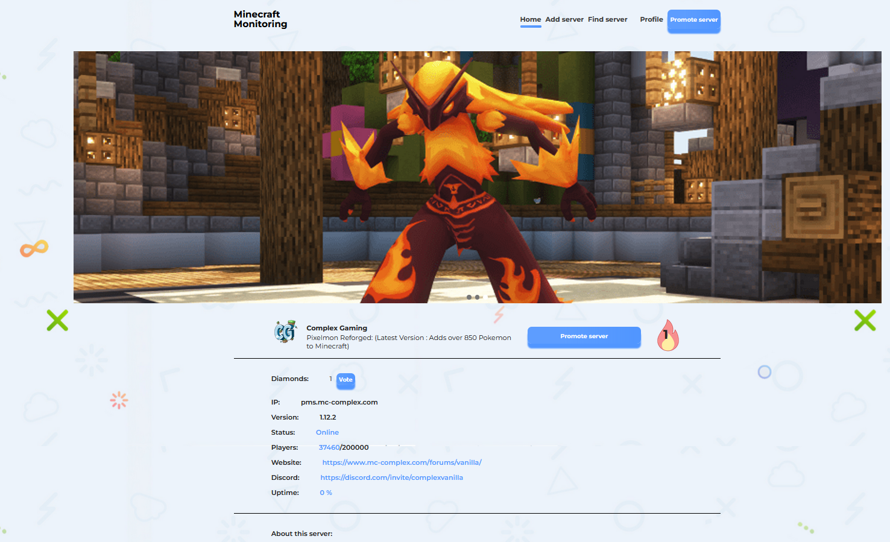

# 🌍 Minecraft Servers Monitoring

This is a Django-based system that helps you keep track of Minecraft server uptime, donation checks, and more! 🚀  
It leverages Redis and Celery for background tasks (like checking server statuses and handling donations), and uses Docker Compose for easy deployment with Nginx and PostgreSQL.

---

## 🛠️ Features

- **⏰ Server Uptime Monitoring:** Tracks the status of your Minecraft servers in real-time.

- **💸 Servers Promotion via Donations:** Project uses **Donatello** to provide ability to buy "diamonds"

- **🧪 Mock Data:** Includes mock data for testing purposes, which can be optionally loaded.
- **🐳 Docker Compose:** Docker-based deployment, complete with Nginx as the reverse proxy.
- **📊 PostgreSQL:** PostgreSQL as the database backend for all server and donation data.

---

## 📸 Screensots

### Servers list


### Server edit


### Sign in form


### Add/find server


### Articles list


### Article


---

## ⚙️ Setup and Installation

### 1. Configure the environment variables

Create a `.env` file and configure the necessary environment variables (example in `.env.example`).

### 2. Load mocj data (optional)

You can choose to **load mock data** for testing. Set the `AUTO_EXPORT_FIXTURE` environment variable to `1` or `0` to decide whether to load it.
Mock data contains admin user (email: `admin@admin.com`, password: `some_pass`)

### 3. Build and run the Docker containers

Run the following command to build and start the Docker containers:

```bash
docker-compose up --build
```

This will set up the Django application, Redis, PostgreSQL, Nginx, celery worker and beat containers.

### 4. Access the Application

- The application will be available at: `http://localhost` 🌐

---

## 🔑 Key Components

- **Celery** 🐝: Manages background tasks for checking server uptime, sending emails, and processing donations.
- **Redis** 🔥: Acts as a broker for Celery to handle task queues.
- **Nginx** 🌐: A reverse proxy for handling incoming traffic and serving the Django application.
